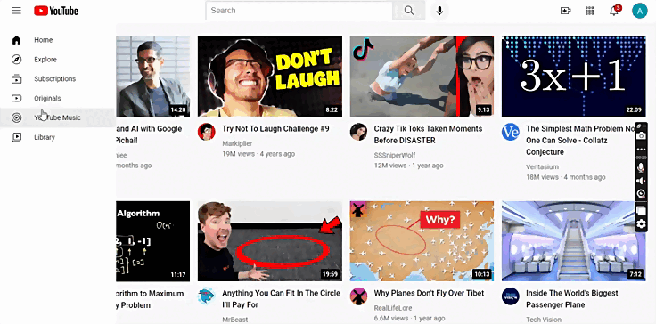

# YouTube Homepage Clone

This project is a static clone of the YouTube homepage, created using HTML and CSS. The primary purpose of this project is to demonstrate foundational skills in web development, specifically in building responsive and visually appealing user interfaces.

## Table of Contents

- [Features](#features)
- [Demo](#demo)
- [Technologies Used](#technologies-used)
- [Getting Started](#getting-started)
- [Contributing](#contributing)

## Features

- **Basic Layout**: Replicates the essential structure of the YouTube homepage, including header, main content, and footer.
- **Responsive Design**: Ensures a responsive design that adapts to various screen sizes, making it accessible on different devices.
- **Styling**: Mimics the visual style of the YouTube homepage, using CSS for layout, colors, and typography.

## Demo

Live Link: [YouTube.com Clone](https://amrit-sharma-7.github.io/YouTubeHomePageClone/youtube.html)




## Technologies Used

- HTML
- CSS

## Getting Started

To run this project locally, follow these steps:

1. Clone this repository:

```bash
git clone https://github.com/Amrit-Sharma-7/YouTubeHomePageClone
```

2. Open the project folder:

```bash
cd YouTubeHomePageClone
```

3. Open the `youtube.html` file in a web browser.

## Contributing

Contributions are welcome! If you find any issues or have suggestions for improvement, please open an issue or create a pull request.
